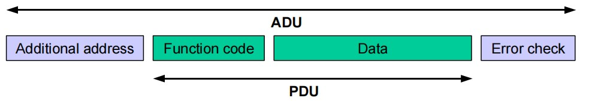

# AT32F437 Bootloader

## 说明

- 本仓库为基于 `RT-Thread v4.1.1` 版本实现的 AT32F437 Bootloader，识别 `download` 分区中的固件并搬运到 `app` 分区中运行。

- 支持通过 `RS485` 强制进入 Bootloader 进行升级，可下载固件到 `download` 分区和 `app` 分区。

- 使用 RT-Thread 固件打包工具将 bin 文件打包成 rbl 文件。该 Bootloader 不支持压缩和加密形式的固件。

- RT-Thread 固件打包工具在 tools/packing 目录下。

- RS485 升级工具在 tools/rs485_update 目录下。

- 使用 `scons --target=mdk5 -s` 生成工程

## 资源占用

- MCU: AT32F437VMT7

- HSE: 12M

- SPI FLASH: W25Q128
  - SPI2:
    - PD1: SCK
    - PD3: MISO
    - PD4: MOSI
  - CS:
    - PD0

- RS485:
  - USART6:
    - TX: PA4
    - RX: PA5
  - EN: PA6

- ERTC_BPR
  - ERTC_DT15

- 分区使用：

  | 分区 | Flash 设备 | 偏移地址 | 占用空间 |
  | ---- | ---- | ---- | ---- |
  | Bootloader | 内部 Flash | 0 | 64 * 1024 |
  | app | 内部 Flash | 64 * 1024 | 1 * 1024 * 1024 |
  | download | SPI Flash | 0 | 1 * 1024 * 1024 |

## RS485 固件升级

- 配置好串口并打开串口

- 点击 `开始同步` 按钮后再 `上电` 或 `重启`，强制进入 Bootloader

- 点击 `结束同步` 按钮

- 选择下载到 `download` 分区还是 `app` 分区

- 选择文件开始升级

- 地址一栏填 `0` 即为广播

### 下载打包固件(rbl) 到 `download` 分区

  

### 下载原始固件(bin) 到 `app` 分区

  

### 固件升级协议

使用 `0x50` 作为固件升级的特殊功能码。

分包传输固件数据，每包数据最大 4096 字节。

- `Data` 字段协议定义：

  | 命令 | 字节数 | 数据 |
  | ---- | ---- | ---- |
  | 2 Bytes | 2 Bytes | N Bytes |

- 命令:

  | 命令 | 说明 |
  | ---- | ---- |
  | 0x0001 | 同步 |
  | 0x0002 | 停留 Bootloader 确认 |
  | 0x0003 | 启动升级 |
  | 0x0004 | 写 IAP 数据 |
  | 0x0005 | 执行升级运行 |

- 0x0001 同步

  上位机控制器上电前开始持续发送同步命令，控制器上电 2s 后停止，控制器停留 Bootloader 中等待上位机进一步操作。

  发送：

  | 命令 | 字节数 | 数据 |
  | ---- | ---- | ---- |
  | 00 01 | 00 00 | / |

  响应：

  无

- 0x0002 停留 Bootloader 确认

  发送：

  | 命令 | 字节数 | 数据 |
  | ---- | ---- | ---- |
  | 00 02 | 00 00 | / |

  响应：

  | 命令 | 字节数 | 数据 |
  | ---- | ---- | ---- |
  | 00 02 | 00 00 | / |

- 0x0003 启动升级

  该操作处理时间较长，上位机等待响应的时间需要放大。

  发送：

  | 命令 | 字节数 | 数据 |
  | ---- | ---- | ---- |
  | 00 03 | 00 05 | flash类型(1B) 固件总大小(4B) |

  flash类型：

  | 值 | 说明 |
  | ---- | ---- |
  | 1 | app 分区 |
  | 2 | download 分区 |

  响应：

  | 命令 | 字节数 | 数据 |
  | ---- | ---- | ---- |
  | 00 03 | 00 01 | 0：失败 1：成功 |

- 0x0004 写 IAP 数据

  发送：

  | 命令 | 字节数 | 数据 |
  | ---- | ---- | ---- |
  | 00 04 | 4+N | 包序号(2B) 数据长度(2B) 数据(NB) |

  响应：

  | 命令 | 字节数 | 数据 |
  | ---- | ---- | ---- |
  | 00 04 | 00 03 | 包序号(2B) 状态(1B)：失败(0)/成功(1) |

- 0x0005 执行升级运行

  发送：

  | 命令 | 字节数 | 数据 |
  | ---- | ---- | ---- |
  | 00 05 | 00 00 | / |

  响应：

  | 命令 | 字节数 | 数据 |
  | ---- | ---- | ---- |
  | 00 05 | 00 00 | / |

## 联系人信息

- 维护：马龙伟
- 邮箱：<2544047213@qq.com>
